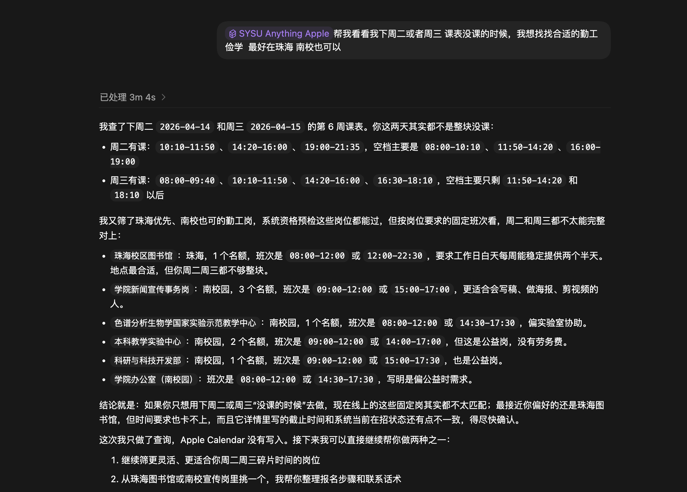
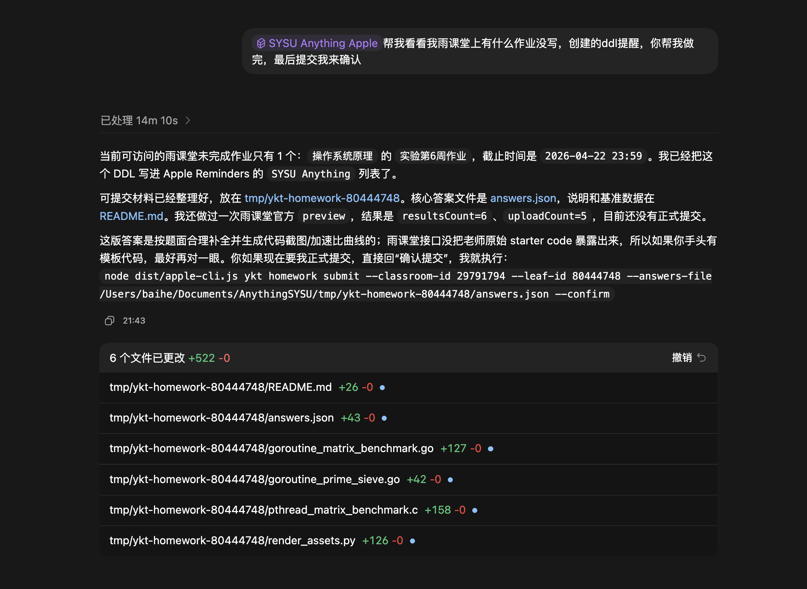
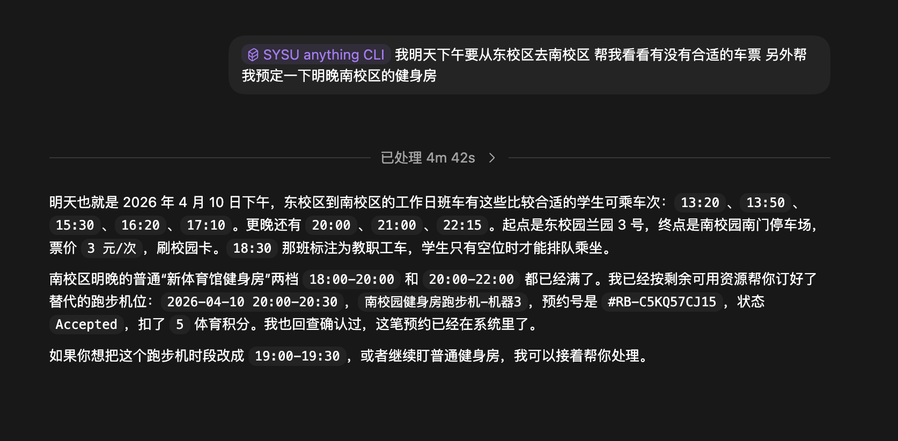
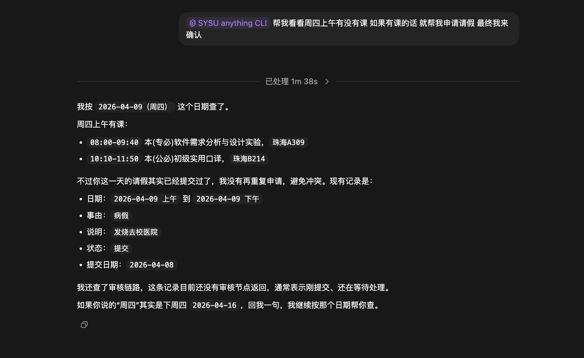
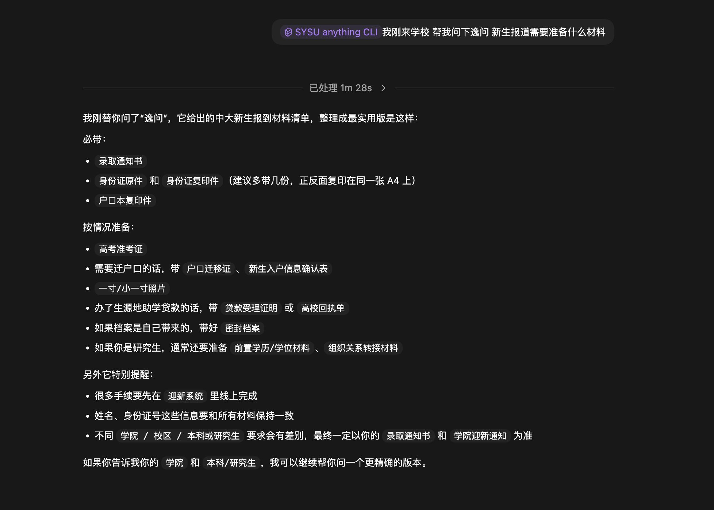

# SYSU-Anything.skill

> 让 Agent 打通你的校园所有场景。

`SYSU-Anything.skill` 不是一个普通的校园工具集合，而是一层面向 AI Agent 的校园操作系统。

它想做的事情很直接：

- 把中山大学分散在不同网站、不同登录体系、不同交互逻辑里的服务打通
- 把这些能力沉淀成 Agent 可以直接调用的 skill layer
- 让 Agent 真正进入你的校园日常，从查信息到办事情，从提醒到日历闭环，把效率拉到新的量级

一句话理解：

**这不是“再做一个校园脚本”，而是把 SYSU 的校园服务升级成 AI Native 的基础设施。**

## 🚀 你该装哪个版本？

这个项目对外提供两套使用方案：

- `sysu-anything-cli-skill`
  标准版，跨平台可用，适合 Windows / Linux / macOS
- `sysu-anything-apple-skill`
  Apple 增强版，仅适合 macOS 12+（Monterey+，支持 Apple Silicon / Intel），用来把同一套校园能力接进 Apple Calendar / Apple Reminders

推荐规则非常简单：

- 非 macOS 或 macOS 11 及以下：装 `sysu-anything-cli`
- macOS 12+：装 `sysu-anything-cli + sysu-anything-apple`

最重要的一点：

**除了 Apple Calendar / Apple Reminders 集成以外，Apple 版和标准版的校园能力基本一致。**

**当前 npm 发布的 Apple 原生桥接二进制已经支持 macOS 12+；如果你之前在 macOS 12 上装过旧版本，重新升级到最新即可。**

## 🧩 它到底打通了什么？

下面这些缩写，不再需要你自己记：

| 模块 | 它是什么 | Agent 可以帮你做什么 |
| --- | --- | --- |
| `Bus` | 广州校区班车 | 查班次、看时刻、筛选合适车次 |
| `QG` | 珠海-广州岐关车 | 查余票、选线路、生成微信下单入口 |
| `JWXT` | 教务系统 | 查今日课表、查全量课表、请假、看请假进度 |
| `YKT` | 雨课堂 | 登录、查作业、看 DDL、准备提交材料、做提醒闭环 |
| `Chat` | 校内问答 / 校园资讯 | 查校内新闻、问新生报到、问校园信息 |
| `Gym` | 体育场馆系统 | 查场地、查空位、预约健身房或球场 |
| `libic` | 图书馆空间 / 研讨室 | 查空闲、准备预约、同步进日程 |
| `USC` | BPM 预约中心 | 课室、会议场所、学生活动预约的查询、填写、保存验证与最终提交 |
| `Explore` | 交叉探索平台 | 查组会、查课题、准备报名或预约 |
| `Career` | 就业系统 | 查宣讲会、招聘会、岗位详情、准备投递 |
| `XGXT` | 学工系统 | 勤工助学、长假离返校、学工相关流程 |
| `Apple` | Apple Calendar / Reminders | 把高价值校园动作写进你的时间系统 |

换句话说，这个 skill pack 的目标不是做一个点工具，而是把“查课表、看班车、报讲座、约场馆、投简历、同步提醒”这些分散动作，收束成一个 Agent 可以持续理解、持续执行、持续协作的统一能力层。

## 📦 怎么安装？

### 1. OpenClaw / ClawHub

这是最适合公开分发和日常安装的方式。

非 macOS：

```bash
clawhub install sysu-anything-cli
npm i -g sysu-anything
```

macOS 12+：

```bash
clawhub install sysu-anything-cli
clawhub install sysu-anything-apple
npm i -g sysu-anything
```

### 2. OpenAI Codex / Codex Cloud

适合已经在用 Codex、Codex Cloud、或兼容 `~/.codex/skills` 的 Agent 运行时。

标准版：

```bash
npx -y sysu-anything-cli-skill@latest deploy --target codex
```

macOS 12+ 再额外安装 Apple 增强版：

```bash
npx -y sysu-anything-apple-skill@latest deploy --target codex
```

一键部署：

```bash
curl -fsSL https://raw.githubusercontent.com/qybaihe/SYSU-Anything/main/install/codex.sh | bash
```

### 3. AI IDE

适合 Cursor、Windsurf、Cline、Trae、Copilot Workspace、以及任何支持本地 prompt pack / skill bundle / `AGENTS.md` 的 AI IDE。

标准版：

```bash
npx -y sysu-anything-cli-skill@latest deploy --target ai-ide --dest ./SYSU-Anything.skill
```

macOS 12+ 再额外安装 Apple 增强版：

```bash
npx -y sysu-anything-apple-skill@latest deploy --target ai-ide --dest ./SYSU-Anything.skill
```

一键部署：

```bash
curl -fsSL https://raw.githubusercontent.com/qybaihe/SYSU-Anything/main/install/ai-ide.sh | bash
```

## 🍎 Apple 兼容性

Apple 增强版依赖预编译 Apple 原生桥接二进制，目前已发布支持：

- macOS 12+（Monterey+）
- Apple Silicon + Intel

说明：

- 较早的已发布预编译版本曾使用 `macOS 13+` 目标，所以会和 macOS 12 不兼容；当前最新发布已经下放到 `macOS 12+`
- 一键部署脚本会自动判断系统版本：只有 macOS 12+ 才会附带部署 `sysu-anything-apple`
- 如果你之前已经安装过旧版 `sysu-anything`，直接升级到最新即可拿到新的 Apple bridge
- 如果你在本地维护源码，也可以自行构建 Apple 桥接：

```bash
APPLE_BRIDGE_MACOS_TARGET=12.0 npm run build
```

## 🔒 隐私与安全

这个项目在设计上尽量把隐私风险压低：

- **不保存你的校园账号密码**
- 登录相关流程优先走 **二维码验证** 或 **官方授权回跳**
- 更倾向于复用已有登录态，而不是让你把敏感凭据直接交给 Agent
- 目标是尽量避免把账号密码暴露给脚本、对话上下文或第三方环境

对用户来说，最直观的体验就是：

**你不需要把账号密码交给这个 skill，很多关键流程都尽量通过扫码验证来完成。**

## ✨ 为什么它值得用？

`SYSU-Anything.skill` 现在已经覆盖并统一了大量高频校园场景：

- 🚌 广州校区班车
- 🚍 珠海-广州岐关车
- 📚 JWXT 教务系统：今日课表、全量课表、请假
- 📝 YKT 雨课堂：登录、作业、DDL、提交准备
- 💬 校内 Chat / 知识库问答 / 新生问询
- 🏋️ 体育场馆查询与预约
- 🏛️ libic 图书馆空间 / 研讨室
- 🧾 USC / BPM：课室、会议场所、学生活动预约
- 🔬 交叉探索平台组会 / 课题
- 💼 就业系统宣讲会 / 招聘会 / 岗位投递
- 🎓 XGXT 学工系统：勤工助学 / 长假离返校
- 🍎 Apple Calendar / Apple Reminders 校园闭环

## 🖼️ 真实使用案例

下面这些都不是 demo，而是已经跑通的真实使用场景。

### 1. 🍎 Apple 版：结合课表筛选勤工助学岗位

Agent 会先看你下周空课时间，再去 XGXT 学工系统里筛适合的勤工助学岗位，给你明确建议。



### 2. 🍎 Apple 版：把雨课堂 DDL 写进 Apple Reminders

先查 YKT 雨课堂里还有哪些作业没交，再自动创建提醒，必要时还能把提交材料一起准备好，最后等你确认。



### 3. 🧰 标准版：跨系统联动查班车 + 处理健身房预约

一次提问里同时处理多个校园系统：先查校区班车，再接着处理体育场馆预约。



### 4. 🧾 标准版：JWXT 教务系统请假与进度确认

不只是“帮你申请请假”，还会先核对当天有没有课、有没有历史记录、当前审核链路到哪一步，避免冲突。



### 5. 💬 标准版：校园问答 / 新生报到信息整理

刚来学校也可以直接问，Agent 会把零散的校内信息整理成可执行版本，不只是扔链接给你。



## 💡 你可以怎么用它

有了这两个 skill，你的 Agent 可以自然接管很多校园动作，例如：

- “帮我看今天在珠海校区有什么课，顺手同步进日历”
- “查一下明天岐关车有没有票，生成下单入口，并提醒我提前出发”
- “看一下最近校内新闻，优先走校内资讯源”
- “帮我查一下 gym 某个场地今天晚上还有没有空位”
- “把这场宣讲会导入我的日历，并提醒我带简历”
- “把雨课堂这门课所有有 DDL 的作业写进提醒事项”
- “查一下 libic 明天下午有没有空研讨室，能约的话帮我准备好预约参数”
- “帮我创建课室预约草稿，活动类别按院系非教学类，提交成功后写进日历和提醒事项”
- “看看勤工助学有没有新岗位，把报名时段同步成未来几周的固定日历块”

这不是 demo。它已经是一套可以真正进入你校园日常工作流的 Agent skill stack。

## 🔗 npm 包

- [sysu-anything-cli-skill](https://www.npmjs.com/package/sysu-anything-cli-skill)
- [sysu-anything-apple-skill](https://www.npmjs.com/package/sysu-anything-apple-skill)

## 📄 License

MIT

## 🌌 项目方向

`SYSU-Anything.skill` 会继续沿着一个非常明确的方向演进：

- 更完整地打通中大校园平台
- 更彻底地把碎片化校园服务收束为统一 skill
- 让 Agent 从“会回答问题”走向“会真正替你完成校园事务”
- 让你的时间、提醒、任务、课表、出行、求职、活动形成闭环

如果说传统校园工具解决的是“你能不能自己找到入口”，
那 `SYSU-Anything.skill` 想解决的是：

**你的 Agent 能不能直接替你理解场景、调用系统、组织行动，并持续提升你的生活效率。**

这就是它的野心。
